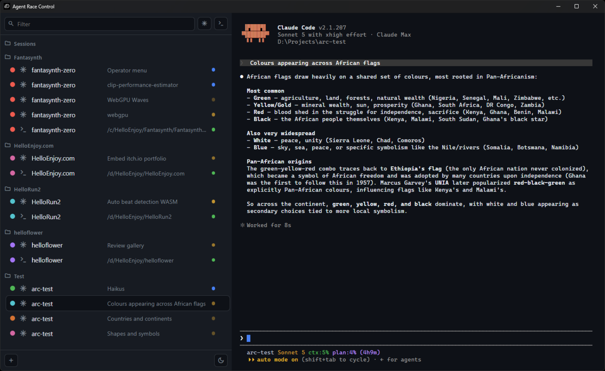

# Agent Race Control

A minimal terminal cockpit for [Claude Code](https://code.claude.com) on native Windows: **one window, one taskbar icon**, every Claude Code session and every plain shell you run alongside them — in a single timing tower you can glance at and a terminal you can drive.

Inspired by the **F1 timing tower**: a column of colored entries, each with a name and a live status, telling you the state of the whole race at a glance — then you click one to go on board.



Built on a hard rule: the **unmodified `claude` CLI in a real pseudo-terminal** (ConPTY via node-pty). No SDK, no wrapper, no reimplementation — so everything the terminal has works by construction: rewind, `/btw`, agent view, remote control, resume, plan mode, MCP, hooks. If it works in Windows Terminal, it works here.

## Features

- **Timing tower** — every session with an editable name, live conversation title, and status
- **Live status** from Claude Code itself: 🟢 running · 🟠 waiting for you (pulses) · 🔵 idle at the prompt · ⚪ exited
- **Two session types** — Claude sessions (`bash --login -i -c 'exec claude'`) and first-class Git Bash shells for dev servers, builds, git
- **Resume across restarts** — sessions reopen with their conversations (`--resume`, deterministic session ids)
- **Folders** — one level of grouping with drag & drop (sessions between folders, folders reorderable)
- **Filter bar** — text search over name/title/path, plus Claude/shell type chips
- **Session colors** synced *into* Claude Code: pick a color on the dot and the app types `/color <name>` for you, so agent view matches
- **GitHub Light/Dark/System** theming (exact Primer palettes) — the app's chrome only; Claude Code renders untouched
- **Windows Terminal conventions** — Ctrl+Shift+C/V copy/paste, right-click copy/paste, file drop pastes the quoted path, Ctrl+=/−/0 window zoom. Zero new muscle memory, nothing shadowed.
- **Right-click context menu** — Show in Explorer, copy path, duplicate session, rename, color, close

## Requirements

- Windows 10 1809+ (ConPTY)
- [Git for Windows](https://gitforwindows.org/) (Git Bash — auto-discovered)
- [Claude Code](https://code.claude.com/docs/en/quickstart) on your PATH
- Node.js 22+

## Run

```bash
npm install
npm run dev        # development (HMR)

npm run build
npm run preview    # production build
```

No installer yet — packaging is planned post-v1.

## State

Everything lives in one human-readable JSON: `%APPDATA%\Agent Race Control\state.json` (sessions, directory groups, appearance, zoom, tower width). No database. Delete it to start fresh.

## Design notes

The full design record — every decision, constraint, and verified gotcha — is in [`docs/agent-race-control-kickoff.md`](docs/agent-race-control-kickoff.md). The short version: minimalism is a hard requirement, and Claude Code purity is the reason this exists.

## License

[MIT](LICENSE)
