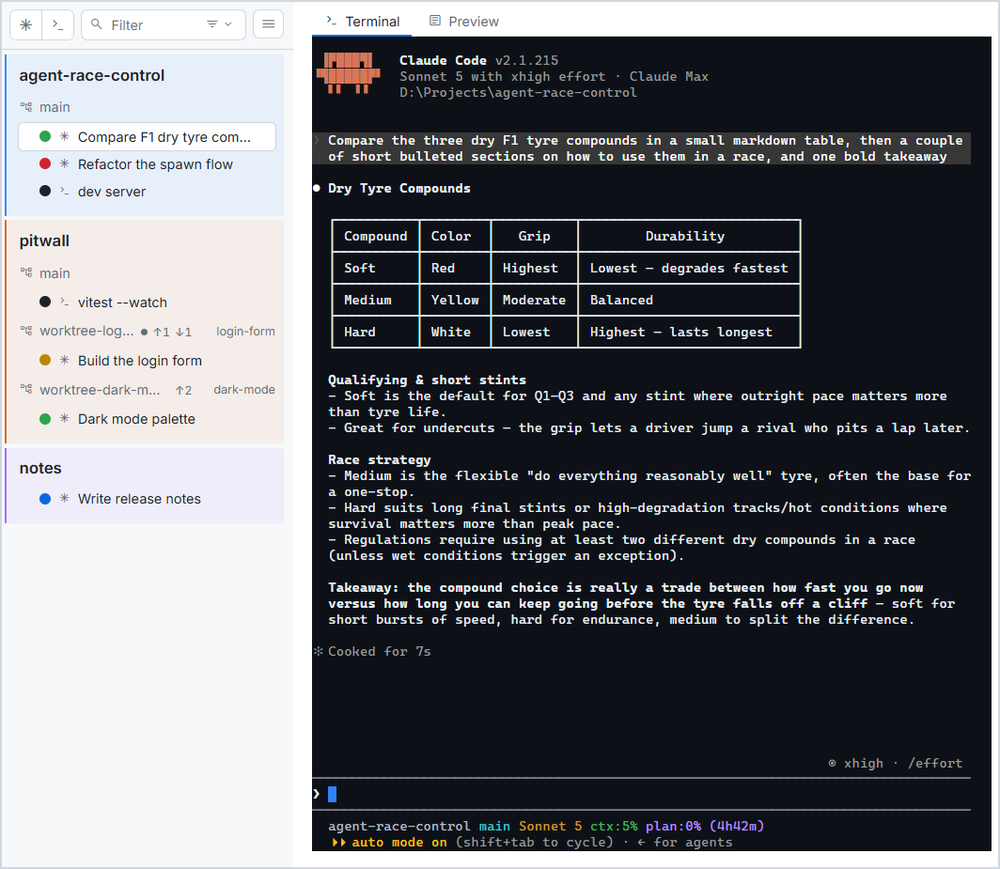
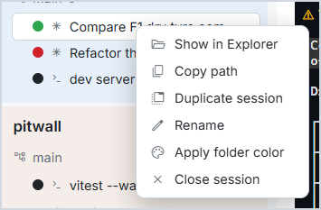
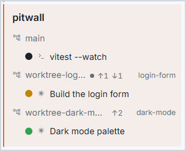
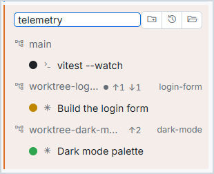
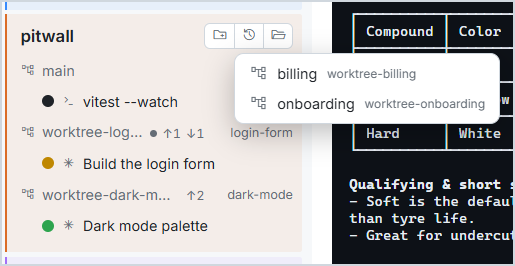
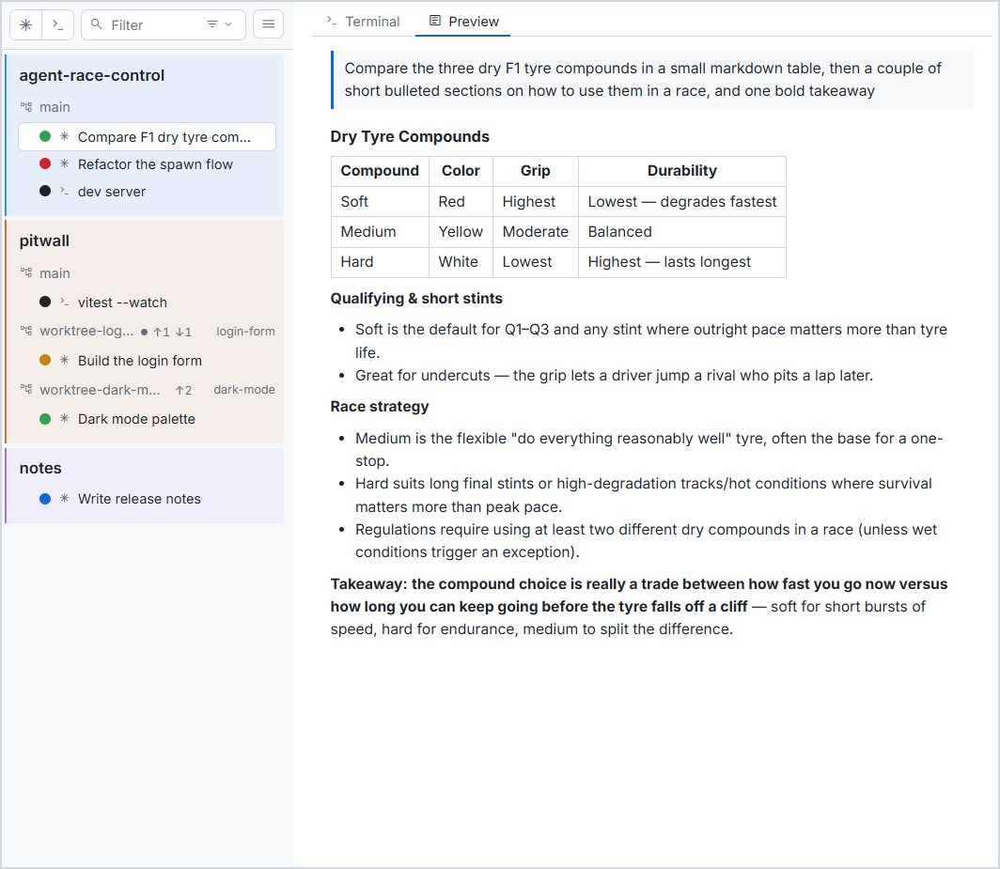
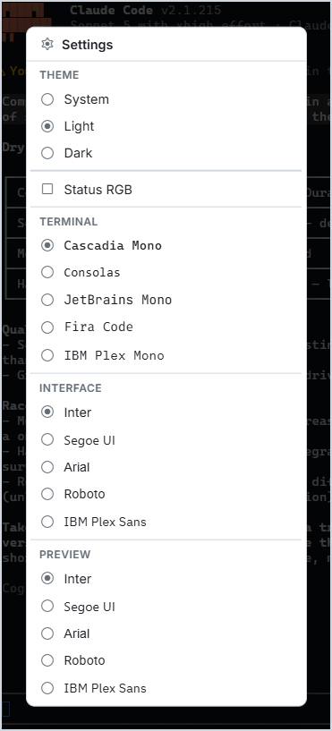

# Agent Race Control — User Guide

The complete tour of the app. Every screenshot below follows your reading theme — view this page in dark mode and you'll see the dark app, in light mode the light app.

> New here? The [README](../README.md) is the short pitch; [`agent-race-control-kickoff.md`](agent-race-control-kickoff.md) is the design record. This page is the manual.

<picture>
  <source media="(prefers-color-scheme: dark)" srcset="../images/arc-hero-dark.png">
  
</picture>

## The window

One window, one taskbar icon. The **timing tower** on the left lists every session; the **terminal pane** on the right drives the one you clicked. Drag the divider between them to resize the tower (persisted). There are no other windows, panels, or docks — if you need another terminal, you spawn another row.

The name comes from the F1 broadcast graphic: a column of colored entries, each with a name and a live status, telling you the state of the whole race at a glance — then you click one to go on board.

## The timing tower

### Status dots

Every row leads with a status dot — traffic lights from *your* point of view:

| Dot | Meaning |
|---|---|
| 🔴 running | the agent is busy — nothing for you to do |
| 🟠 waiting (pulses) | Claude wants you: a permission prompt or a question |
| 🟢 idle | at the prompt — your turn |
| ⚪ shell | a live shell session (shells only run or exit) |
| faded | the process exited |

Status comes from Claude Code itself (its hook events, received over localhost — pure observation, every hook is answered "carry on"). The app also reads the keystrokes you type for the transitions hooks are blind to — dismissing a dialog with Esc, interrupting with Ctrl+C — so the dot tracks reality either way.

**Click a dot to flag it TODO** — a "come back to this one" marker. It's purely cosmetic and clears itself the next time the session's real status changes color.

### Cards

Sessions group into cards by where they run:

- **A plain folder card** — the directory's name, its sessions under it.
- **A repo card** — a git repository. All the repo's worktrees gather under one card, one **branch row** each (more under [Repo cards & worktrees](#repo-cards--worktrees) below).

Each card has a colored team stripe. Colors come from Claude Code's own `/color` vocabulary and are auto-assigned per directory; right-click a card title to change one. Click a card's name to **collapse** it to a single title row — a roll-up dot keeps showing the most urgent status inside; click again to expand.

Hovering a card title (or a branch row) reveals its spawn cluster: **new Claude session here**, **new shell here**, **show in Explorer**.

### Reordering

Everything drags. Drag a card to reorder the groups; drag a row to reorder sessions within their card. A session's directory is a fact of its running process, so rows can't move between cards.

### The filter bar

The bar above the tower filters as you type — matching session names, conversation titles, and paths. The chip next to it filters by type (Claude sessions / shells / all). Esc clears the text. The two buttons on the left spawn sessions: each opens a menu of recent directories plus **Browse…**.

## Sessions

### Two types

- **Claude sessions** — the unmodified `claude` CLI in a real ConPTY (spawned as `bash --login -i -c 'exec claude'`). Everything the terminal has works by construction: rewind, `/btw`, agent view, plan mode, MCP, resume, hooks.
- **Shell sessions** — first-class Git Bash shells for dev servers, builds, git. Same tower, same rows, white dot.

### Naming

Double-click a row's name to rename it.

- A **shell's** name is a plain local label ("dev server").
- A **Claude session's** name *is its conversation's name*: the rename types `/rename <name>` into the session for you, so the tower and Claude's own UI stay in sync. This only happens at an idle prompt — never while Claude is busy or a dialog is open. Untouched Claude sessions display their conversation title, live from the terminal title.

### The context menu

<picture>
  <source media="(prefers-color-scheme: dark)" srcset="../images/arc-session-menu-dark.png">
  
</picture>

Right-click a row: **Show in Explorer**, **Copy path**, **Duplicate session** (same type, same directory, fresh process — Windows Terminal's "duplicate tab"), **Rename**, **Apply folder color** (types `/color <name>` so Claude's agent view matches the tower stripe), **Close session**.

### Closing and resuming

The **×** on a row closes the session the way closing a terminal window would — the process is killed, the row disappears. It does *not* type `/exit`, so Claude Code's graceful-exit behaviors (like worktree cleanup) don't run; the conversation file stays in Claude's own history.

**Restarting the app restores the tower.** Claude sessions reopen *into their conversations* (`--resume` with pinned session ids); shells reopen fresh in their directory. Sessions that exited before the restart are gone — a session that ended is gone.

## Repo cards & worktrees

<picture>
  <source media="(prefers-color-scheme: dark)" srcset="../images/arc-worktrees-dark.png">
  
</picture>

A repo card is the multi-feature cockpit: **one card per repo, one worktree per feature, as many sessions per feature as the job needs.** Each branch row shows the branch name, the worktree's folder name on the right, and state markers when there's something to know:

| Marker | Meaning |
|---|---|
| ● | uncommitted changes in that worktree |
| ↑n | commits ahead of the branch's base |
| ↓n | commits behind it |

Hover the row for the spelled-out version ("uncommitted changes · 1 ahead · 1 behind vs main"). The base is the branch's upstream if it has one, otherwise your local `main`/`master` — so ↑ answers *"is this merged into my main yet?"*, which is the question you're actually asking before closing a feature. Markers refresh when the window regains focus and whenever a session's turn ends — no polling.

### Starting a feature

<picture>
  <source media="(prefers-color-scheme: dark)" srcset="../images/arc-worktree-new-dark.png">
  
</picture>

The repo card's **➕ folder button** starts a Claude session in a **fresh worktree**: type a name and press Enter (blank lets Claude pick a name; Esc cancels). The app spawns `claude --worktree <name>` — **Claude Code creates the worktree** (`.claude/worktrees/<name>/`, on a new branch `worktree-<name>`), the app never touches git. The branch row appears immediately with the session parked on it; the first prompt confirms the real directory.

### Finishing a feature

Type `/exit` in the session. With nothing pending, **Claude Code removes the worktree itself** ("Cleaning up worktree — no pending changes"); with uncommitted changes it asks first. **The branch always survives** — merge it, then delete it whenever you like. Closing the row with × (or a crash) skips cleanup: the worktree stays on disk, *parked*.

### Reopening a parked worktree

<picture>
  <source media="(prefers-color-scheme: dark)" srcset="../images/arc-reopen-dark.png">
  
</picture>

The card's **history button** lists the repo's worktrees that currently have no rows — kept at exit, stranded by ×, or made by hand. Pick one and a Claude session reopens there (a `.claude/worktrees/` worktree re-attaches Claude Code's create-and-clean-up lifecycle; any other worktree just gets a session in its directory). Committed work is preserved.

### Worth setting up per repo

- add `.claude/worktrees/` to `.gitignore`
- list env files (`.env`…) in a [`.worktreeinclude`](https://code.claude.com/docs/en/worktrees) so new worktrees get copies
- a worktree is a bare checkout — make `npm install` your first prompt, or automate it with a personal `WorktreeCreate` hook
- run plain `claude` once in a new repo first (worktrees need the trust dialog accepted)

## The conversation preview

<picture>
  <source media="(prefers-color-scheme: dark)" srcset="../images/arc-preview-dark.png">
  
</picture>

Every Claude session carries a second tab: a **read-only preview of the conversation**, rendered as markdown — headers, tables, bullets, code — straight from the transcript Claude Code itself writes. It follows the conversation live, drops tool noise but keeps the code Claude writes (file listings, `+/-` tinted diffs), and its text is selectable — reading a long answer here beats scrolling xterm.

Pure observation: nothing is injected, the terminal byte stream is untouched, and flipping between Terminal and Preview is instant.

## Appearance

<picture>
  <source media="(prefers-color-scheme: dark)" srcset="../images/arc-settings-dark.png">
  
</picture>

The ☰ button opens Settings:

- **Theme** — GitHub Light / Dark / System, the exact Primer palettes. This themes the app's chrome and terminal colors; Claude Code's own rendering passes through untouched.
- **Status RGB** — swaps the status dots' Primer tones for pure traffic-light red/amber/green.
- **Fonts** — the terminal's monospace face (Cascadia Mono, Consolas, JetBrains Mono, Fira Code, IBM Plex Mono) and the sans faces for the app chrome and the preview.

**Zoom** is on the keyboard: `Ctrl+=` / `Ctrl+-` / `Ctrl+0`, Windows-Terminal style, whole-window.

## Keyboard & mouse

The app deliberately adds *no* muscle memory on top of Windows Terminal, and shadows nothing — every keystroke not listed here goes straight to the terminal:

| Input | Action |
|---|---|
| `Ctrl+Shift+C` / `Ctrl+Shift+V` | copy / paste in the terminal |
| Right-click in the terminal | copy selection, else paste |
| Drop a file on the terminal | pastes the quoted path |
| `Ctrl+=` / `Ctrl+-` / `Ctrl+0` | zoom in / out / reset |
| Double-click a row name | rename |
| Right-click a row | context menu |
| Click a status dot | toggle its TODO flag |
| Click a card name | collapse / expand the card |

## State

Everything lives in one human-readable JSON: `%APPDATA%\Agent Race Control\state.json` — sessions, groups, colors, theme, fonts, zoom, tower width. No database, no cloud. Delete it to start fresh. The app writes nothing else outside its own data directory: your `~/.claude/settings.json` is never touched (per-session hook settings are passed at spawn), and no git command is ever run against your repos — reading branch state excepted, worktree creation and cleanup are Claude Code's own doing.
